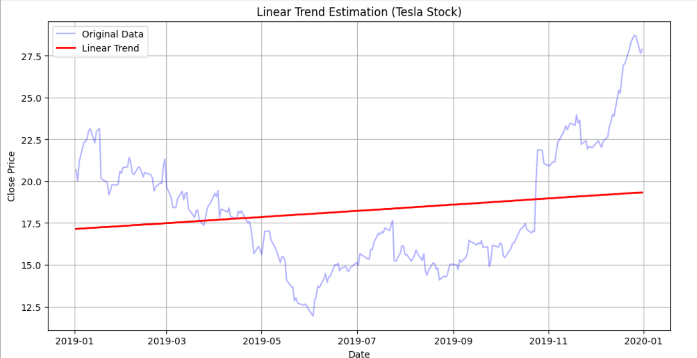
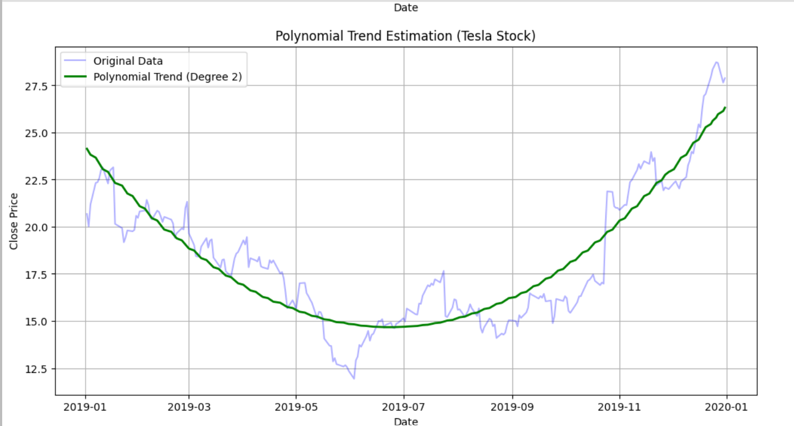

# Developed by: Pranave B
# Register Number: 212221240040

# Ex.No: 02 LINEAR AND POLYNOMIAL TREND ESTIMATION

### AIM:
To Implement Linear and Polynomial Trend Estiamtion Using Python.

### ALGORITHM:
Import necessary libraries (NumPy, Matplotlib)

Load the dataset

Calculate the linear trend values using least square method

Calculate the polynomial trend values using least square method

End the program
### PROGRAM:

```python
import pandas as pd
import numpy as np
import matplotlib.pyplot as plt

# Load the Tesla Stock dataset
file_path = '/mnt/data/tsla_2014_2023.csv'
data = pd.read_csv(file_path)

# Convert 'date' column to datetime and sort the data
data['date'] = pd.to_datetime(data['date'])
data.sort_values('date', inplace=True)

# Filter data for a specific range (e.g., 1 year from January 1, 2019, to January 1, 2020)
start_date = '2019-01-01'
end_date = '2020-01-01'
filtered_data = data[(data['date'] >= start_date) & (data['date'] <= end_date)]

# Extract date and close price for the filtered range
dates = filtered_data['date']
prices = filtered_data['close']

# Calculate linear trend for the close prices
coeffs_linear = np.polyfit(np.arange(len(prices)), prices, 1)
linear_trend = np.polyval(coeffs_linear, np.arange(len(prices)))

# Calculate polynomial trend (degree 2) for the close prices
coeffs_poly = np.polyfit(np.arange(len(prices)), prices, 2)
poly_trend = np.polyval(coeffs_poly, np.arange(len(prices)))

# Plotting Linear Trend
plt.figure(figsize=(12, 6))
plt.plot(dates, prices, color='blue', alpha=0.3, label='Original Data')  # Use transparency
plt.plot(dates, linear_trend, color='red', linewidth=2, label='Linear Trend')
plt.xlabel('Date')
plt.ylabel('Close Price')
plt.title('Linear Trend Estimation (Tesla Stock)')
plt.legend()
plt.grid(True)
plt.show()

# Plotting Polynomial Trend
plt.figure(figsize=(12, 6))
plt.plot(dates, prices, color='blue', alpha=0.3, label='Original Data')  # Use transparency
plt.plot(dates, poly_trend, color='green', linewidth=2, label='Polynomial Trend (Degree 2)')
plt.xlabel('Date')
plt.ylabel('Close Price')
plt.title('Polynomial Trend Estimation (Tesla Stock)')
plt.legend()
plt.grid(True)
plt.show()

```

### OUTPUT


A - LINEAR TREND ESTIMATION


B- POLYNOMIAL TREND ESTIMATION


### RESULT:
Thus ,the python program for linear and Polynomial Trend Estiamtion has been executed successfully.
